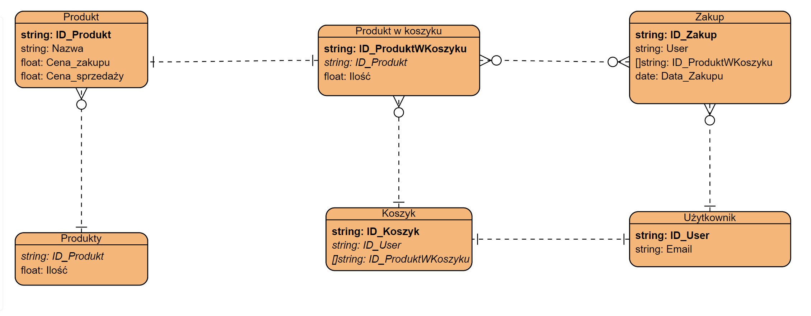

# Sklep internetowy 
Projekt zespołowy - Błażej Gajewski, Jan Łuczyński, Amelia Ziemann, Mateusz Śledzikowski(Lider)

Zainteresowani mentoringiem

# Założone funkcjonalności

- Użytkownicy
- Filtrowanie bazy produktów
- System opinii
- Koszyk z zapisem produktów, również po wyjściu ze strony
- Historia zakupów dla użytkownika
- Maile dotyczące statusu zamówienia
- Powiadomienia dla administratora dla niskich stanów magazynowych
- Aktualizowanie dostępności produktów na stronie
- Wyszukiwanie produktów, sugestie innych
- Utworzenie narzędzi do analizy dla admninistratora
- Informacja o najbliższym sklepie i czasie w jaki do niego dojedziesz na podstawie googleApi

# Wstępne technologie:
- backend - Golang
- frontend - Astro + React
- database - MongoDB
- login i hosting - Firebase

#Diagram erd

